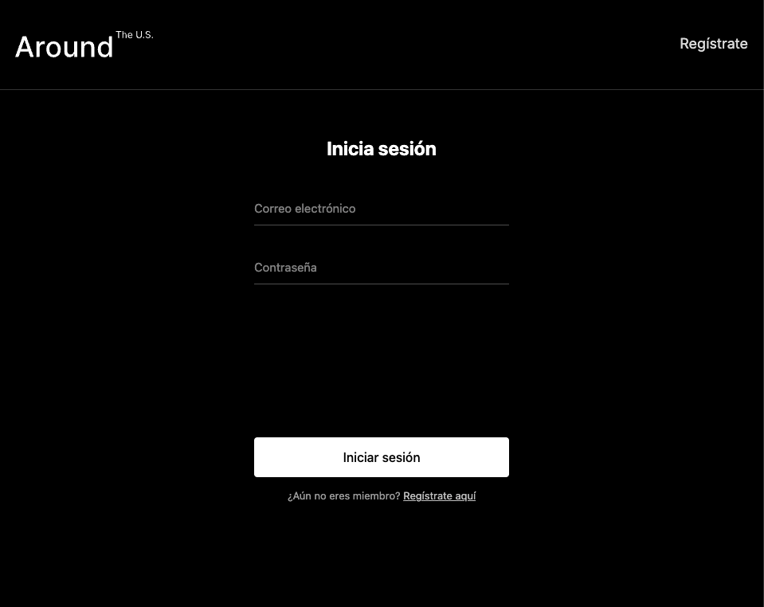
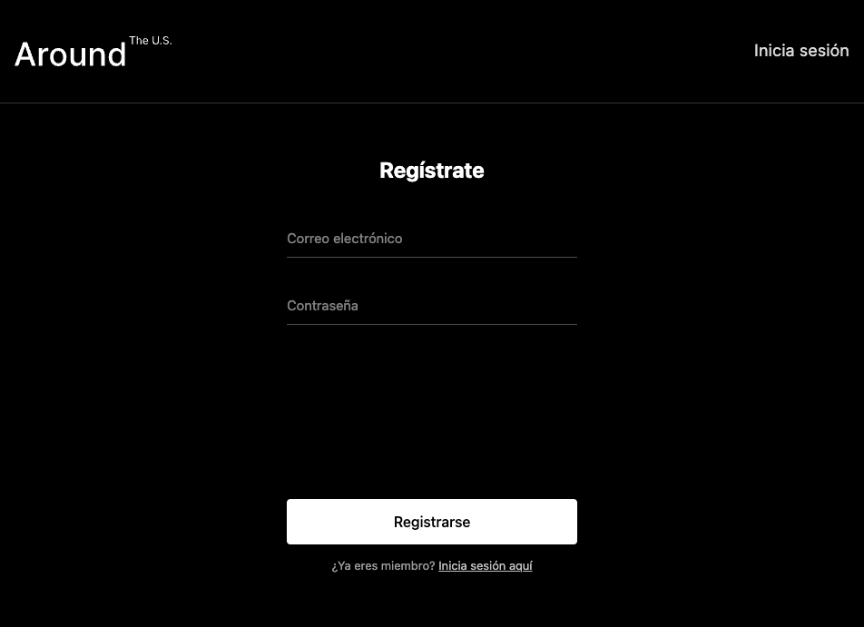
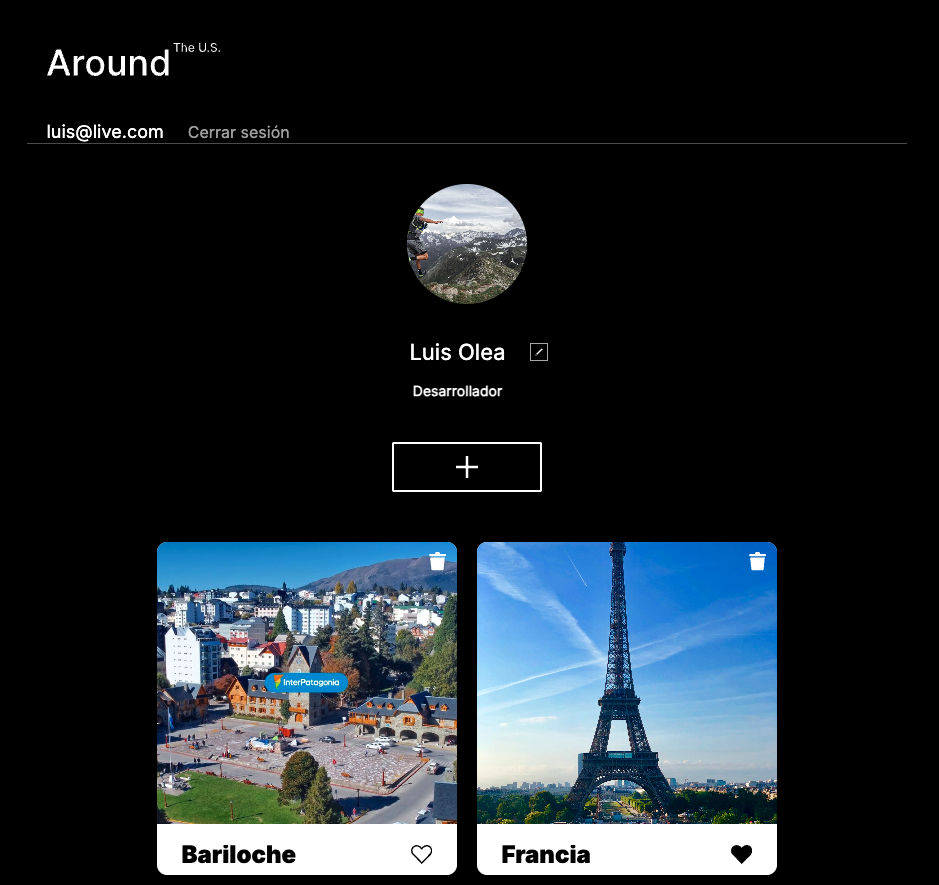

# Around the U.S. - API Full Stack

Aplicación full stack de una galería social. Permite registrar usuarios, iniciar y
mantener una sesión con JWT, editar el perfil y el avatar, publicar tarjetas,
marcarlas como favoritas y eliminar únicamente las tarjetas propias.

## Funcionalidad de la parte 1

- Registro con correo único y contraseña cifrada con bcrypt.
- Inicio de sesión con un JWT válido durante siete días.
- Persistencia del token en `localStorage`.
- Verificación automática de la sesión al recargar la aplicación.
- Rutas de usuarios y tarjetas protegidas mediante autorización Bearer.
- Valores predeterminados de nombre, descripción y avatar al registrarse.
- Protección contra la eliminación de tarjetas de otros usuarios.
- Exclusión del hash de contraseña en las respuestas de la API.
- Front-end conectado exclusivamente al back-end de este proyecto.

## Tecnologías

Front-end: React, React Router, Vite, JavaScript, CSS y metodología BEM.

Back-end: Node.js, Express, MongoDB, Mongoose, JWT, bcryptjs y validator.

## Estructura

```text
web_project_api_full/
├── frontend/
│   ├── public/
│   └── src/
└── backend/
    ├── controllers/
    ├── middlewares/
    ├── models/
    ├── routes/
    └── app.js
```

## Ejecución local

Se necesita Node.js, pnpm y MongoDB ejecutándose en
`mongodb://localhost:27017/aroundb`.

En una terminal:

```bash
cd backend
pnpm install
pnpm dev
```

En otra terminal:

```bash
cd frontend
pnpm install
pnpm dev
```

El front-end estará disponible en `http://localhost:5173` y la API en
`http://localhost:3000`. No se requiere un archivo `.env` para desarrollo.

## Capturas







## URL de la aplicación

La URL pública se añadirá durante la parte 2, correspondiente a configuración y
despliegue.

## Autor

Luis Alberto Olea.
