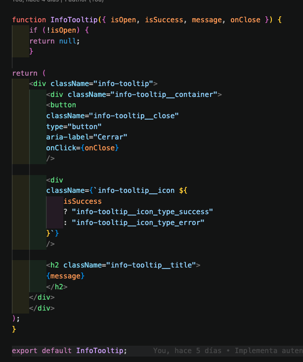

# Tripleten web_project_around_auth

## Descripción

**Around The U.S.** es una aplicación web desarrollada con React que permite a los usuarios registrarse, iniciar sesión, mantener una sesión activa mediante JWT y acceder a una galería de tarjetas protegida por autenticación.

Este proyecto forma parte del Sprint de autenticación de TripleTen y extiende una aplicación previa de galería interactiva, incorporando rutas protegidas, manejo de sesión, validación de token, formularios de registro e inicio de sesión, manejo de errores y comunicación con APIs externas.

La aplicación permite:

- Registrar nuevos usuarios.
- Iniciar sesión con usuarios existentes.
- Guardar el token JWT en `localStorage`.
- Validar automáticamente el token al recargar la página.
- Proteger rutas para usuarios no autorizados.
- Cerrar sesión eliminando el token.
- Mostrar mensajes de éxito o error mediante un modal informativo.
- Consultar y renderizar información del usuario y tarjetas desde una API.
- Redirigir rutas no existentes según el estado de autenticación.

## Tecnologías utilizadas

- HTML5
- CSS3
- JavaScript ES6+
- React
- React Router DOM
- Vite
- API REST
- JWT
- LocalStorage
- Context API
- Git y GitHub
- Metodología BEM
- Diseño responsivo

## Funcionalidades principales

### Autenticación

La aplicación implementa un flujo completo de autenticación:

1. El usuario puede registrarse desde `/signup`.
2. El usuario puede iniciar sesión desde `/signin`.
3. Si el inicio de sesión es correcto, la API devuelve un JWT.
4. El JWT se guarda en `localStorage`.
5. Al recargar la página, la aplicación valida el token con la API.
6. Si el token es válido, el usuario permanece autenticado.
7. Si el token no existe o es inválido, el usuario es redirigido a `/signin`.

### Rutas protegidas

La ruta principal `/` está protegida mediante un componente `ProtectedRoute`.

Además, se agregó una ruta comodín para manejar URLs no existentes:

- Si el usuario está autenticado y entra a una ruta inválida, se redirige a `/`.
- Si el usuario no está autenticado y entra a una ruta inválida, se redirige a `/signin`.

### Manejo de sesión

El usuario puede cerrar sesión desde el encabezado de la aplicación. Al hacerlo:

- Se elimina el JWT de `localStorage`.
- Se actualiza el estado de autenticación.
- Se limpia el correo del usuario.
- Se redirige al usuario a `/signin`.

### InfoTooltip

La aplicación utiliza un modal informativo para mostrar mensajes de éxito o error en acciones como:

- Registro exitoso.
- Registro fallido.
- Inicio de sesión fallido.

## Estructura principal del proyecto

src/
├── blocks/
│   ├── auth.css
│   ├── header.css
│   ├── footer.css
│   ├── InfoTooltip.css
│   └── ...
├── components/
│   ├── App.jsx
│   ├── Header/
│   ├── Main/
│   ├── Footer/
│   ├── Login/
│   ├── Register/
│   ├── ProtectedRoute/
│   └── InfoTooltip/
├── contexts/
│   └── CurrentUserContext.js
├── images/
├── utils/
│   ├── api.js
│   └── auth.js
├── index.css
└── main.jsx

## APIs utilizadas

El proyecto trabaja con dos APIs distintas:

### API principal

Se utiliza para obtener y modificar datos de usuario y tarjetas:

Obtener información del usuario.
Obtener tarjetas iniciales.
Agregar nuevas tarjetas.
Eliminar tarjetas.
Dar o quitar likes.
Actualizar perfil.
Actualizar avatar.

### API de autenticación

Se utiliza para:

Registrar usuarios.
Iniciar sesión.
Validar el token JWT.
Instalación y ejecución local

## Instalación y ejecución local

### Clona el repositorio 

git clone web_project_around_auth 

### Entra a la carpeta del proyecto

cd web_project_around_auth 

### Instala las dependencias

pnpm install

### Inicia el servidor de desarrollo 

pnpm dev

### Abre el proyecto en el navegador 

http://localhost:3000 

## Inicio de sesión

## Registro

## Página principal

## Modal de éxito o error

## Autor

Desarrollado por Luis Alberto Olea como parte del programa de Desarrollo Web de TripleTen.

